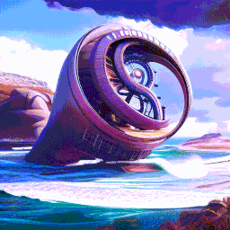
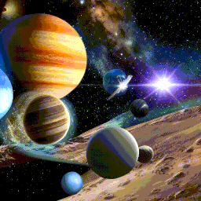
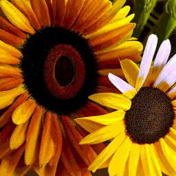
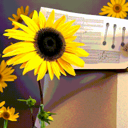
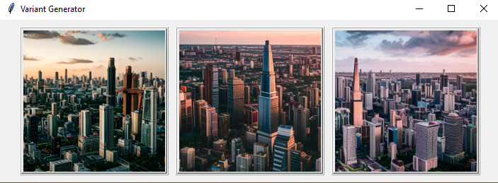

# Stable Diffusion Variant Animation Generator
Create animations where each frame is a variant of the one before!

<div align="center">

|  |  |
|:----------------------------:|:---------------------------:|
|     Example with lerping     |   Example without lerping   |

</div>

<details>
<summary>How it works</summary>

This project is based on the image variation model [here](https://huggingface.co/lambdalabs/sd-image-variations-diffusers)
(credit to Justin Pinkney). The model is Stable Diffusion v1.4, finetuned to
condition solely on CLIP image embeddings, rather than text embeddings.
This allows it to be used as an image variation generating model.

You can _almost_ create an interesting animation by repeatedly generating image variants of the previous
image (see 'output without CLIP guidance' below). To avoid this issue,
I add a CLIP guidance step between generations, where the image embedding
is shifted slightly to increase the similarity to several 'positive' prompts,
and likewise reduce its similarity to negative prompts.

Lerping the image embedding and noise between frames for a smoother animation is
also supported. It is also possible to slow the rate of change of the noise to
improve smoothness, by setting each new noise based on the previous (rather than
independently sampling).
</details>

## Setup
```
git clone https://github.com/zzbuzzard/sd-variant-anim
cd sd-variant-anim
pip install -r requirements.txt
```
You may want to use a virtual environment, and install `torch` and `torchvision` as 
instructed on the PyTorch website.

The first time you run the code, it will download the image variant HF model (if you don't have it downloaded already).

## Generation without Lerping
To generate a variant animation from a given start image, use this command:
```
python generate.py -i examples/1.png -o out/0 -n 20 -s 20
```
where
 - `-i` specifies input image path (a few examples provided, thanks to Pixabay)
 - `-o` specifies output directory
 - `-s` specifies number of steps for the diffusion process (DPM++ scheduler is used so 20 is ok)
 - `-n` is the number of images to generate
 - See `--help` for many other options.

Note that this uses CLIP guidance by default, with generic default positive and
negative prompts (e.g. move away from 'simple texture' and towards 'high quality').


Output:
<p align="center">
    
</p>


<details> <summary>Output without CLIP guidance</summary>
CLIP guidance may be disabled by setting `--opt-repeats` to 0, or setting both `--clip-positive-scale` and `--clip-negative-scale` to 0.
However, for some reason, the image variant model seems to consistently drop information from one image to the next
without guidance - the images get increasingly simple, until you end up stuck in 'abstract texture' land.

Here is the same animation as above but without CLIP guidance:

```
python generate.py -i examples/1.png -o out/no_guidance -n 20 --opt-repeats 0
```
<p align="center">
    
</p>

</details>

## Generation with Lerping
Lerp mode adds intermediate frames between the variations to produce a smoother
animation. Use `generate_lerp.py`, which is similar to `generate.py`. Example:
```
python generate_lerp.py -i examples/1.png -o out/lerp -n 10 -s 20 -b 2 -f 10 --intermediate 4 --noise-shift-prop 0.35
```
where
 - `-f` gives the frame rate (FPS)
 - `-b` gives the batch size
 - `--intermediate` specifies how many intermediate frames to generate for each variant
 - `--noise-shift-prop` specifies how slowly the init noise should change (1 = independent for each variant, 0 = same noise for all variants)
Output:
<p align="center">
    
</p>


## Manual Choice UI
<p align="center">
    
</p>

The UI lets you create an animation by manually selecting each new variant from a few options.
This gives way more control and lets you avoid the various pitfalls of automatic generation (getting stuck in loops, etc).

```
python generate_choose.py -i examples/1.png -o selected/test --batch-size 3 --speculative
```
here,
 - `--batch-size` controls how many images are generated simultaneously, and so also controls how many images you get to pick between.
 - `--speculative` enables 'speculative generation' mode, where the next results will start being computed before you've
chosen which image you want.
 - See `--help` for many other options (most are the shared with `generate.py`).

This will open a Tkinter window which will allow you to pick from several variants for each frame
(this is how I made the animation at the top of the repo). Keep an eye on the console for details.


### Create Video File
```
python create_video.py -d [directory] -f [fps value]
```
(or use `ffmpeg` for finer control)


### General Tips
 - The guidance scale (larger `--opt-repeats` or `-cn` or `-cp`) seems to be proportional to how 'busy' the images are.
A low scale eventually leads to simple abstract images, while a high scale leads to overly complicated images.
 - You can fiddle with the text prompts being moved away from/towards, but be warned: it's quite fiddly, and
any changes you make will make a big difference (e.g. if you put 'creature' in the positive prompts, creatures will be
everywhere!)
 - Reducing number of steps to 10 produces ok results (`-s 10`), I used this for the examples at the top.
